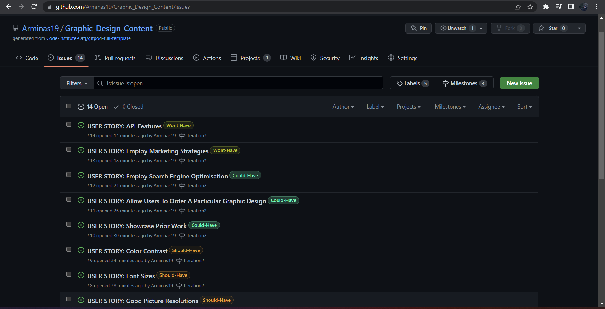
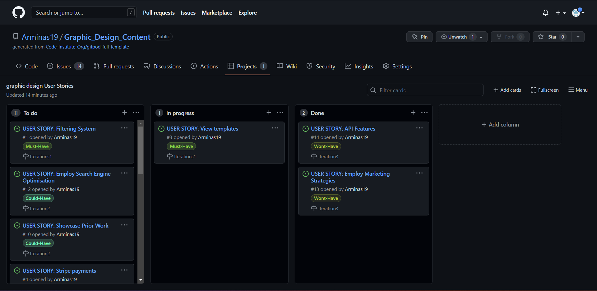
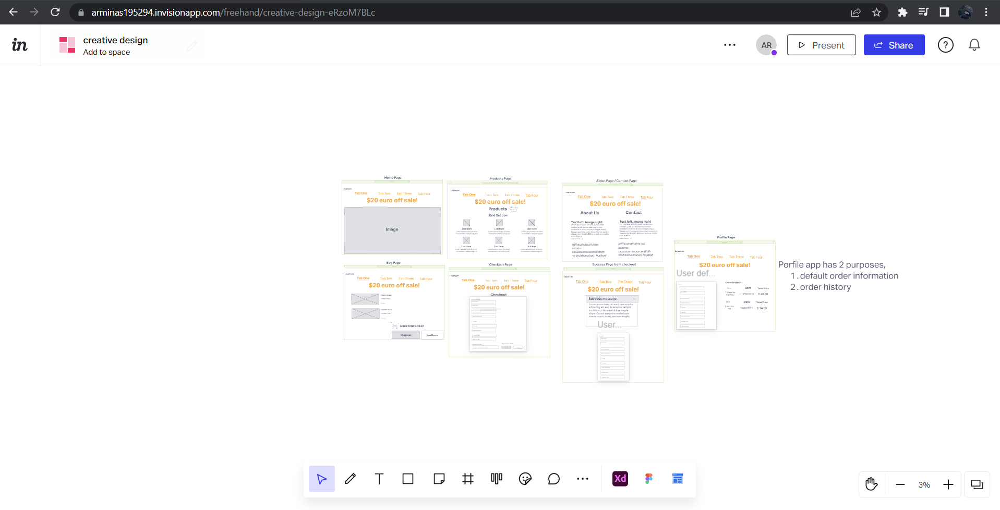
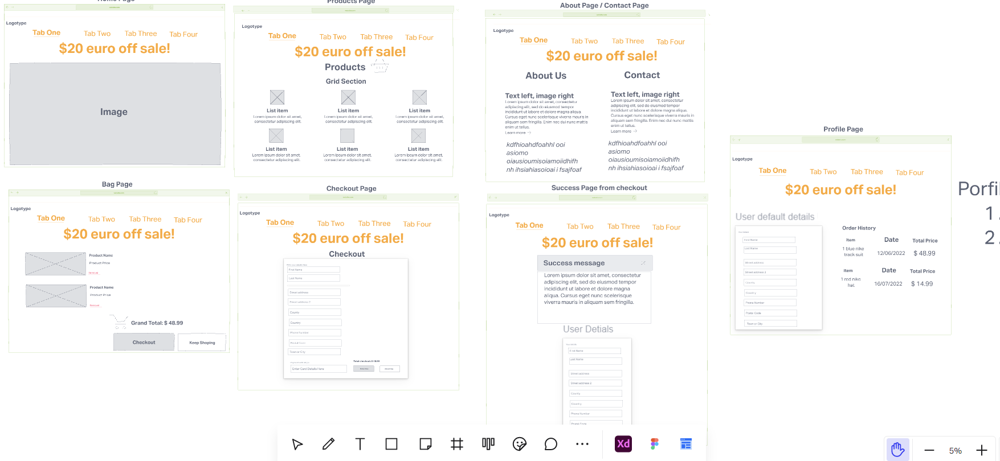
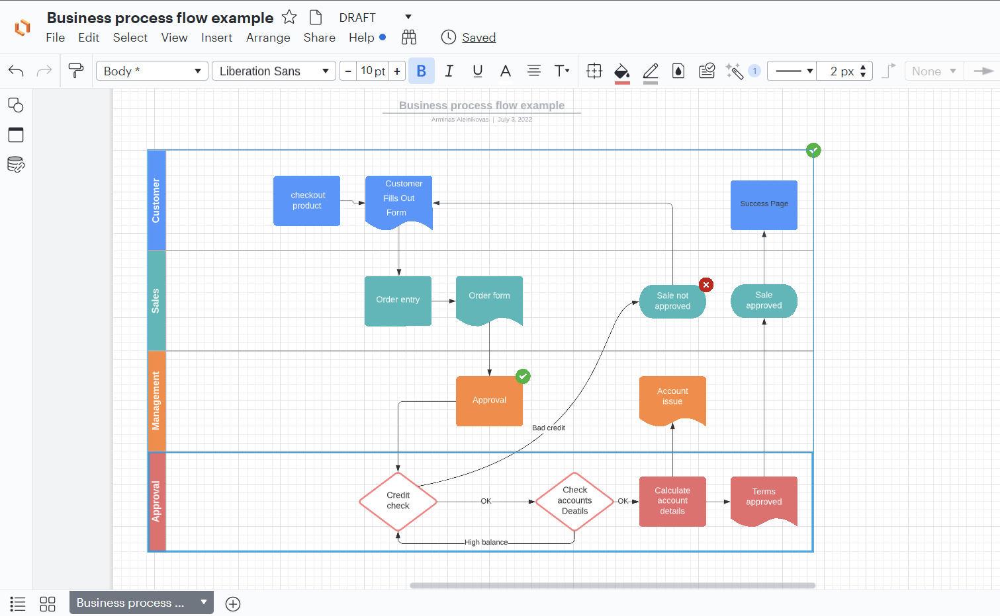
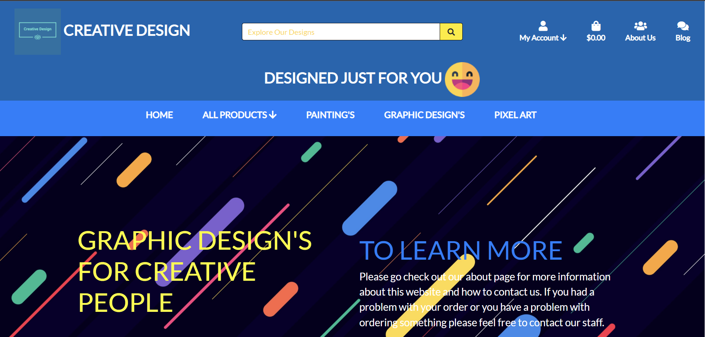
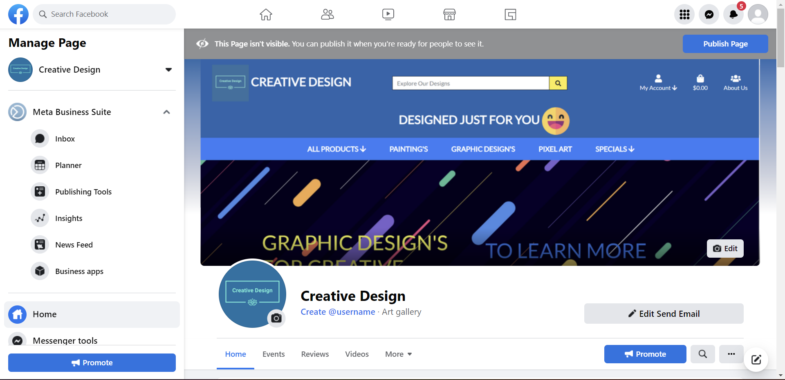

# Creative Design

## Preparation

* I have created User stories so that I could set specific goals for myself. I created some milestones so that I can better organize my time and focus my effort on a specific objective that I set for myself. I also created a project with 3 columns - To do column, In progress column and Done column. I created them so that i can clearly follow the specific goal that i set for myself.

* Things that i did
   + User Stories
   + labels for those User Stories (To Better organize my priorities)
   + Milestones "iteration1", "iteration2" and "iteration3"
   + I also made a project with 3 columns so that i can keep track on my progression.

## Design process

* Before starting my project I thought about how I am going to structure and design my project. The first step I took was to create a diagram on my notes book (a basic sketch of what the website would look like).

* Im chosing the colors of blue and yellow with a tint of dark colors and mixture of bright colors and white for the font because i think those are good colors and go well together.

* I wrote some notes down on what I needed to add to my project so that I won't forget later.

* I turned my basic notes into User stories and then created iterations.  

* I began creating a more detailed wireframe on the "InVision" website.

***

## E-commerce Business Model
* My strategy for conducting business over the Internet is to create a community of people who enjoy the same thing as I do that's why I created a blog page where the user can create blog post's about our products or general things that go along with the theme e.g art, about the website, latest tools for graphic design and more. We sell paintings and graphic designs that have been made by the Creative Design Team, each individual on the team gets a bonus on top of their salary if the product that they have created gets sold. The Creative Design marketing team tries to get more online customers through the market using ads, paid promotions and social media platforms. We use revenue sharing as a strategy to get more customers involved in our store, the paid promotions that we do also include some bonuses for the promotor such as if a certain amount of viewers click on the link and review our website the promotor gets a small percentage of the revenue share.      

* This diagram shows how the purchase of a product is calculated and approved from both sides, the customers and our management systems.
# Introduction To My Website

 Creative Design was created for my 5th propject with Code Institute's Full Stack Software Development course.
 Creative Design is a platform for a customer to purchase our products which the can blog about in our blog page or they can also use the contact form if they find any issues with our products in the about page. The customer can also review the product if they have logged in.
 

 ## Development Of My Website
My strategy for this project was to use what I already know and use the skills that I learned from my previous project with the Boutique Ado E-Commerce Application. I also remembered the mistakes that I did in my previous project and this time i prepared for them properly which helped me finish this project on schedule.

## Website Content & Fetures 
<strong> Base Template </strong>
 
My base.html contains the footer element and the header/nav elements, they's elements are used for every single page on my website. The header/nav elements contain most of the navigation done on this website and it help's the user to get around my website effectively. The footer content contains link's to my social media pages and it also contains the Privacy Policy for my website. The core CSS and JS scripts and links are also attached to my base.html template.  

<strong> About Template </strong>
 
The About Me page is where I have a contact form in case the customer wanted to write a complaint or if they wanted to send some kind of message regarding the website. The About page also has a newsletter subscription form created by MailChimp and a few paragraphs about the company's team and what we do.   

<strong> Blog Template </strong>
 
The Blog page is for customers who want to talk to the broder community, they can talk about what new products the want to see or if they just want to talk about a certain product that is already on the website store. The User of the blog's page is able to create a blog page, delete their blog post or edit and update there blog post.     

<strong> Product's Template </strong>
 
The product's template is used as the store of this website, it contains all of the products that I got from Kaggle.com, which include pixel art, paintings, and graphic designs. When you enter the products page you will see a sorting tab that can sort the products into A-Z, Z-A, low/high price range, and low/high ratings. This feature is very useful for the customer and without that the store could be annoying to navigate through. You can press on the product that you would like to look at, you will be able to see the description and size of the product and a button that allows the customer to place it in the bag, you are also able to select a quantity of that product. The customer can also create a review for that product if they have logged in, the user can delete that product on the review form and they can update that review by creating a new review for that product (it will automatically update the previous review that was made before but if a review was never made it will just create a new review).   

<strong> Bag Template </strong>
 
The Bag template is used to review your selected products, you can update the quantity or remove the product from the bag.  

<strong> Checkout Template </strong>
 
Once the bag template has been reviewed by the customer the customer will press the secure checkout button which will redirect them to the checkout page where the customer will enter their details and be redirected to the checkout success page once they have completed the checkout form.  

<strong> profile Template </strong>
 
The profile page is used only by the customer, it is a way for a customer to set up their billing details and also to save their details for another time that they may buy with us. once a customer buys a product their billing details get automatically saved on their profile page and the next time they buy with us they won't have to re-enter their billing details on the checkout page. 

<strong> Toasts </strong>
 
Their are loads of alert's that the customer might get when they use this site, their are 4 types of alerts, success alerts, error alerts, info alerts and warning alerts. Theys alerts are used all over the website.

<strong> Facebook Page Dedicated to our product </strong>
 
https://www.facebook.com/Creative-Design-111148724932377

## Technologies Used
  + HTML
  + CSS
  + JavaScript
  + Python
  + Pip3- install packages to python
  + Git- version control
  + GitHub- host project files
  + Gitpod- coding enviroment
  + Django- main framework for project
  + Heroku- cloud platform
  + Django Crispy forms- displays forms
  + Stripe - used as secure payement system
  + AWS - Used to store static files
  + Bootstrap - Used for responsiveness
  + Font Awesome - Used for icons such as footer

 
<h1> Testing </h1>
<h2> Validations </h2>
Creative Design website has been tested on Google Chrome, Internet Explorer, Microsoft Edge and Safari browsers (viewed at different desktop, laptop, tablet and mobile).

All links, required fields, buttons, sorting function, forms, blog posts, all drop-down menus, product display, product detail and search bar work as expected.

App has been reviewed also by friends and family.

Code Institutes criteria checklist has been used to check requirements.

<strong> HTML Validations </strong>
<ul>
   <li> Home page is Validated </li>
   <li> About page is Validated </li>
   <li> Profiles page is Validated </li>
   <li> Checkout page is Validated </li>
   <li> Product page is Validated </li>
   <li> Blog page is Validated </li>
   <li> custom_clearable_file_input.html has 2 errors </li>
   <li> Bag page has 5 duplicated id's (5 errors) </li>
</ul>
 
<strong> CSS Validations </strong>
<ul>
   <li> Base.css is Validated </li>
   <li> Profile.css is Validated </li>
   <li> Checkout.css is Validated </li>
</ul>
 
<strong> JavaScript Validations </strong>
<ul>
   <li> stripe_elements.js has 2 ES6 errors  (use esversion: 6) </li>
   <li> countryfield.js is validated (had to change my let to var because of not having esversion 6)</li>
</ul>
 
<strong> Python Validations </strong>
<ul>
   <li> About View is Validated</li>
   <li> Bag View has 9 line too long errors </li>
   <li> Blog View has 2 line too long errors </li>
   <li> Checkout View has 6 line too long errors </li>
   <li> Home View is Validated </li>
   <li> products view has 7 line too long errors and 1 trailing whitespace errors </li>
   <li> profiles view has 2 line too long errors and 2 trailing whitespace errors </li>
</ul>

<strong> Card Paymnets </strong>
*  Card number: 4242 4242 4242 4242
*  Zip & CCV must be filled out with any integers.

<strong> Guest User Experience & Goals </strong>
* Upon entering the site, users immediately view the shop now button to browse all products.
* The website provides a great navbar that's always visible with links for the products page, blog page, and the contact/about page.
* In the navbar, the user can search for a name of a painting, graphic design, or pixel art.
* Every page of the website features a consistently responsive and intuitive layout.
* On the All Products page, the user can see the categories, amount of products, name of the product, rating of a product, price, and the sort input that the user can use to sort their products.
* The sort input has 3 options, rate the product by price, rating, or alphabetical order. 
* User can view the details of a single product. So that they can understand the details and add the product to the checkout page. 
* On the product details page, the user can easily see what other customers thought of the product. 
* Facebook, Instagram, Twitter, Youtube, and Google+ are all located in the footer for easy access to their social media platforms. 

<strong> Registered User Experience & Goals </strong>
* On the checkout page the user can flag the option to save their personal information in their profile so that they won't need to re-write the same information the next time they want to buy something else from the store.  
* On the profile page, the user can check their previous purchases from the store. The user can click on a particular order to check the order details.
* The user can go to their profile page and edit their personal information, also the user can go to the checkout page and edit the information and flag the option to save them to their profile page.
* The user can easily log in, signup, and log out from the website, the signup page has been fixed so now the user can easily receive the verification email once they enter their details.  
* The user can easily recover their password now using the forgot password link on the login page.
* Logged In users can leave a review on products, they can also edit and delete these reviews.
* Logged In users can create a blog post on the blogs page. They can also edit or delete their own posts. The bug with being able to delete or edit other users' posts has been fixed. 

<strong> Admin Features / Test's </strong>
* The Admin can edit or delete every product from the products page and the product details page.
* The Admin can access the Django administration panel and edit the products and the categories.
* The admin can verify emails and give users staff status.
* All They's features have been manually tested. 

## Google Lighthouse
* Results For: 
  + home page - 95 Performance, 94 Accessibility, 75 Best Practices, 100 SEO
  + about page - 79 Performance, 95 Accessibility, 83 Best Practices, 100 SEO
  + blog page - 73 Performance, 93 Accessibility, 67 Best Practices, 100 SEO
  + products page - 78 Performance, 95 Accessibility, 75 Best Practices, 90 SEO
  + bag page - 65 Performance, 75 Accessibility, 75 Best Practices, 90 SEO
  + checkout page - 60 Performance, 96 Accessibility, 75 Best Practices, 100 SEO

## Bugs & Issues
* Known Bugs:
  + Bag page quantity button doesn't work properly so i got rid of them for the large screens but kept them for mobile screen sizes.

* Known Issues:
  + All my product descriptions have been deleted since I didn't add them into the fixtures file before uploading them into Heroku and all the names of the products have been re-set to their defaults.
  + product images that where imported using fixtures are not the same size's. 
  + Toast's sometimes aren't aligned properly when on smaller or bigger screen sizes. 
  + Customer reviews aren't product reviews. The review on the product on the products page isn't affected by the customer's reviews (the review of the product is fixed by the admin).
  + The select image field in the create blog page is not yet customized.   
 

## Fixed Bugs & Issues
 * Fixed Issues: 
  + The product's name and descriptions have been re-made using the admin panel.
* Fixed Bugs:
  + User who weren't the authors of a blog post were able to edit or delete them, they were able to do this by entering the blog post URL. This bug has been fixed by checking if the currently logged-in user (that typed up the blog post URL) was the author of that post.
  + The Shopping bag page had a problem with the quantity functionality. What was happening was that if you had 2 different sizes of the same product and change the quantity it would get rid of the sizes all together. This bug has now been fixed.
  + The shopping bag page had a problem with the quantity buttons. It was able to go down to minus integers which isn't supposed to work like that. Problem fixed by deleting the buttons and instead using the input field to lower/higher the quantity on larger screens. Mobile screens worked fine so I left the quantity buttons only on mobile screens. 

# Deployment
* Github repo - https://github.com/Arminas19/Graphic_Design_Content
* Heroku app - https://graphic-design-project.herokuapp.com/
 
 

<strong> Steps I took for Deploying my website on to Heroku </strong>

I first had to install a few extentions for my project using the command 'pip' than i froze the requirements in the requirements.txt file, Connected my github repo to the heroku app (which i created before starting the deployment process), i added the free Postgres DB and i added Config Vars so that the live site would work as intended, i added a Procfile so that heroku would know which files are apps and which one is the project directory. I modified the settings.py file and than i had to create a new superuser and load the products fixture data to the new database. I modified the settings.py file again adding in the stripe environment variables and later adding in the email environment variables to the settings.py file as well. 
 
 

<strong> Amazon Web Services </strong>

Amazon Web Services(AWS) is used for all static and media files that your live site might have. AWS host's your static and media files in a S3 bucket which you have to set up yourself first.   

You will need to install a few extensions in your terminal first using the command 'pip' and then freeze them in the requirements.txt file. The second step would be to go to the settings.py file and add some Bucket Config vars to your settings also you will need to set the root for your media and static files using the custom_storages.py file and then you will need to override the URLs for those static and media files so that they would be used in production. the last step would be to delete the disable-static var from Heroku and commit your final code and push it to Heroku. 

<strong> Steps i took for Heroku and AWS Deployment </strong>

<ol>
  <li> Crate a new app in Heroku. </li>
  <li> Then put the App name and select the region.  </li>
  <li> Add Heroku Postgres for the database.  </li>
  <li> Install dj_database_url and psycopg2-binary to use Heroku Postgres, and run pip3 freeze > requirements.txt command to add them on requirments.txt.  </li>
  <li> In the settings.py file import dj_database_url, comment out sqlite databases and add dj databases variable temporary while the database is transferred to Heroku Postgres.  </li>
  <li> Migrate changes.  </li>
  <li> Import all products data. Run python3 manage.py loaddata command to load the categories first and the products last. The order of loading is important as all the products are associated with categories.</li>
  <li> Create a superuser with python3 manage.py createsuperuser command.  </li>
  <li> Install gunicorn which acts as the webserver, and freeze it into requirements file with the command pip3 freeze > requirements.txt  </li>
  <li> Create a Procfile.  </li>
  <li> Temporary disable collectstatic by setting heroku config:set DISABLE_COLLECTSTATIC = 1 and host name of Heroku to allowed hosts in settings.py.  </li>
  <li>Initialise Heroku.  </li>
  <li> Set up the automatic deployment.  </li>
  <li> Generate a new secret key, set it in Heroku and update settings.py file. Change the setting of Debug mode that only True in Development mode.  </li>
</ol>

<strong> AWS </strong>

<ol>
  <li> Open AWS S3 and create a new bucket, which stores the files, by completing the name and the region.  </li>
  <li>Set up the basic settings. Enable static website hosting so that it gives a new endpoint for accessing from the internet. Put index.html and error.html as default values.  </li>
  <li> Set up CORS configuration.  </li>
  <li> Set up a Bucket Policy. Generate a policy with AWS policy generator. Add /* at the end of Resource to allow access to all resources in the bucket.  </li>
  <li> Create a user to access the bucket.  </li>
  <li> Attach the policy to the group.  </li>
  <li> Create a user and add it to the group.  </li>
  <li> Update settings.py file to tell Django which bucket it should be communicating with.   </li>
  <li> Add AWS keys to Heroku and set USE_AWS = True under the app 'Settings' tab --> 'Config Vars'  </li>
</ol>

***

## Credits

<strong> <h3> Images </h3> </strong>
I got my products images from the website Kaggle.com
I got my Logo from shopify.com at https://hatchful.shopify.com/
i got my background image from google images. 

<strong> <h3> Code </h3> </strong>
Stack Overflow - I checked Stack Overflow when i got stuck on a problem.
Code Instite - I used some of the code from the Boutique Ado E-commerce website.
Bootstrap - I used bootstrap's code
Youtube - I watched tutorials which helped me get a better understanding on Django.
I reviewed my previous project(4th project) and figured out what worked and what didn't, so I had a clearer vision of how am I going to use my Django skills to finish this project.

<strong> <h3> Help </h3> </strong>
I got help from the Code Institute's tutor assistance team on a few problems that I couldn't solve myself.
I got help from my mentor Sandeep who reviewed my website.
 
 

## Resolution Sizes

<strong> Fully responsive sizes. </strong>